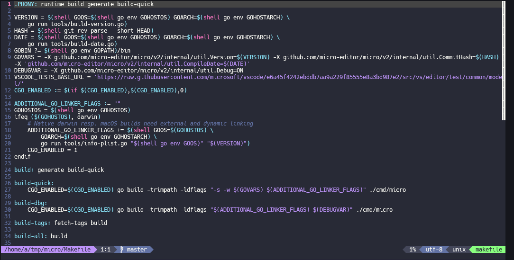

**micro** is a terminal-based text editor that aims to be easy to use and intuitive, while also taking advantage of the capabilities
of modern terminals. It comes as a single, batteries-included, static binary with no dependencies; you can download and use it right now!

This a fork which will include the powerline patch for statusline.go

You will also need the plugin and a modified colorscheme, see here: https://github.com/kusk/micro-powerline
